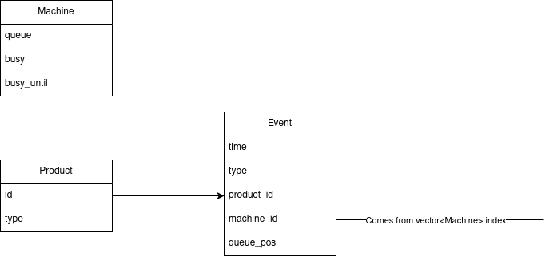

# YADRO task for the  Telecom Team

## Description

This repository contains a solution for the YADRO Telecom Team's technical assesment. [Text](./assets/task.pdf) 

P.S. This is my first time working with Discrete Event Simulation.


*Data structure diagram I created to break the task into smaller pieces.*
## Requirements
- C++11 or higher
- Cmake 3.10

## Build and run

### Build using Cmake:
```text
cmake -B Build
cmake --build build
```
### Run:
```text
./build/task ./assets/input_1.txt
```
